# Steav Fashion — E-Commerce Platform

A full-stack fashion e-commerce platform built with **Flutter** (mobile app) and **NestJS/GraphQL** (backend API).

> **Brand**: Steav Fashion / Monograph  
> **Tagline**: *Beyond The Horizon of Trend*

---

## Screenshots

### Mobile App (Flutter)

| Home | Login | Register | Catalog |
|------|-------|----------|---------|
| 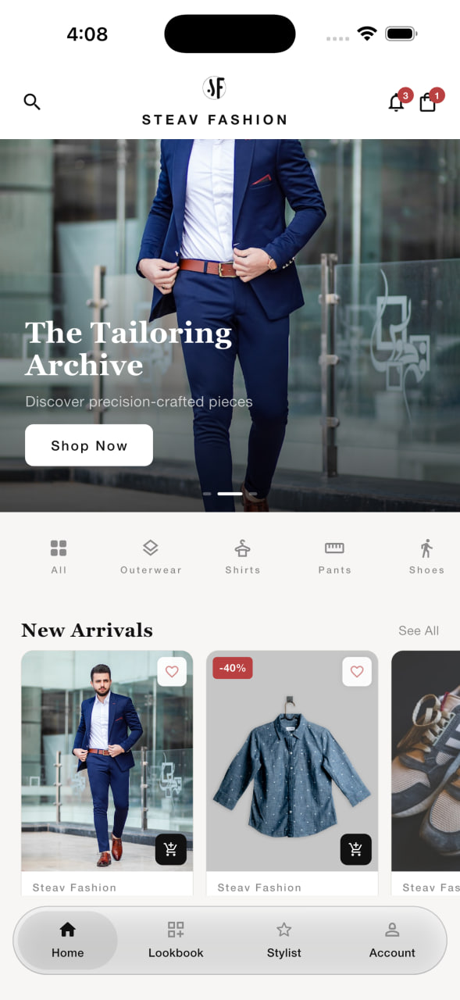 | 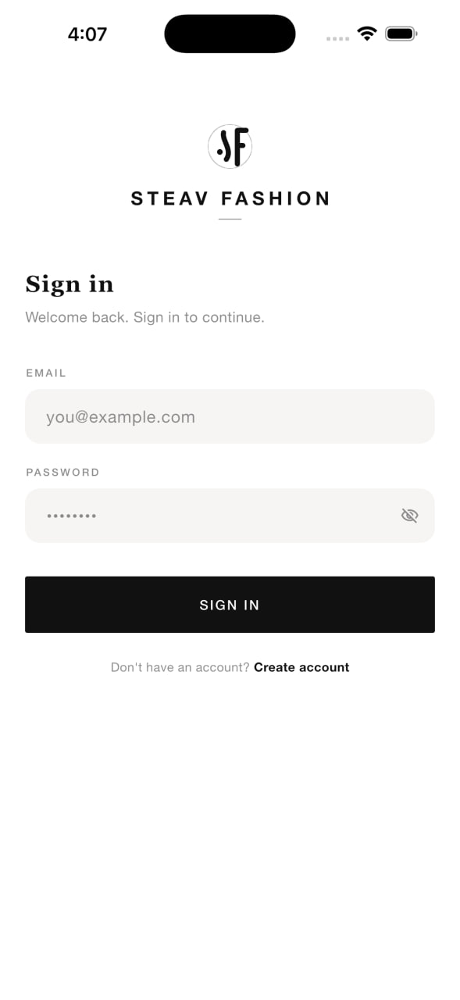 | 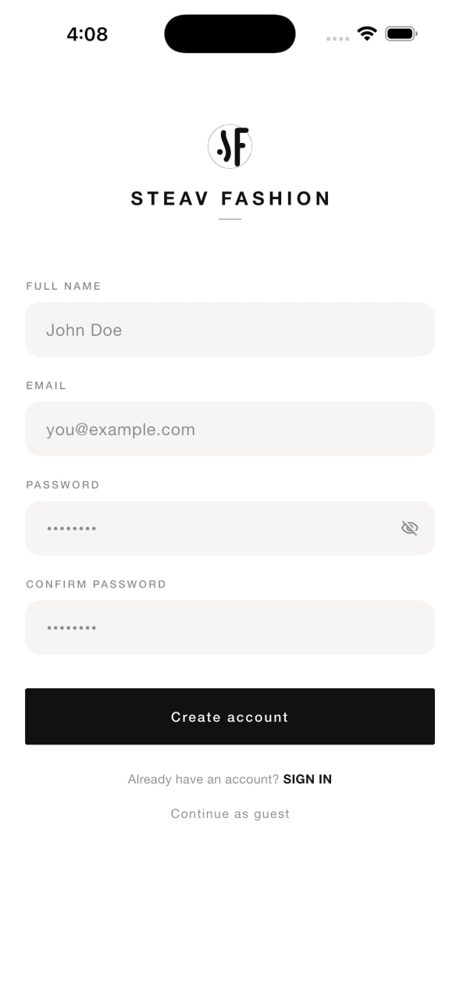 | 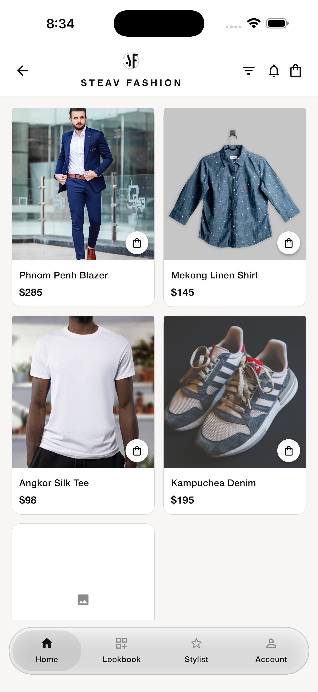 |

| Product Detail | Search | Filter | Lookbook |
|----------------|--------|--------|----------|
| 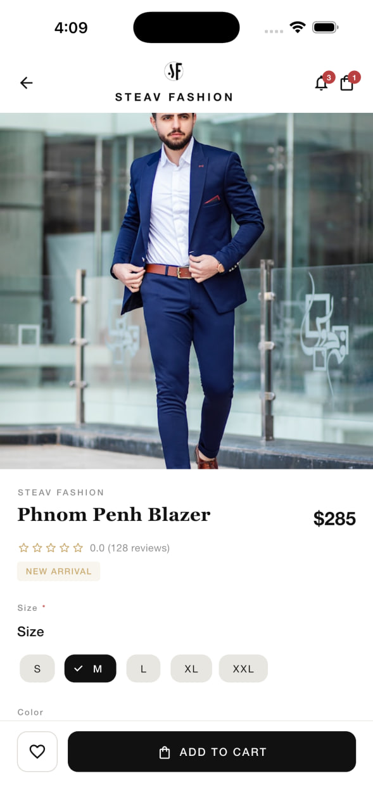 | 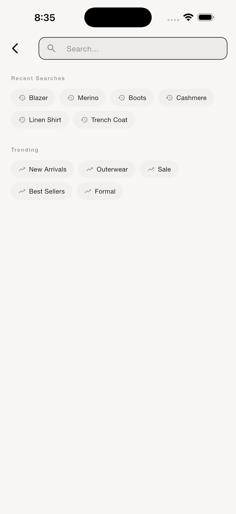 | 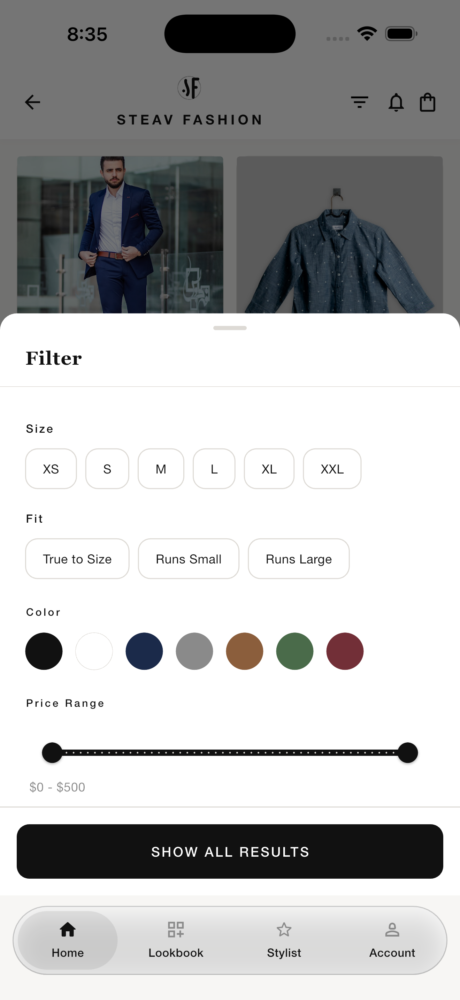 | 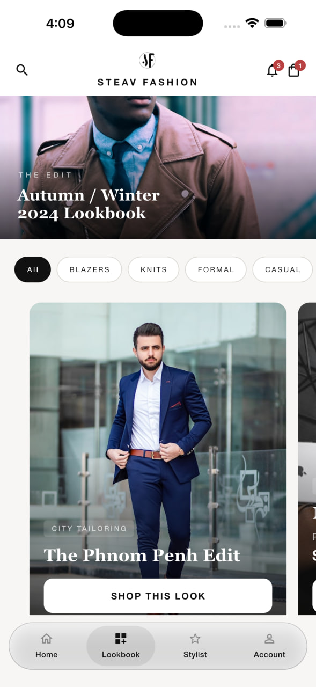 |

| Account | Stylist Chat | Payment | Location |
|---------|-------------|---------|----------|
| 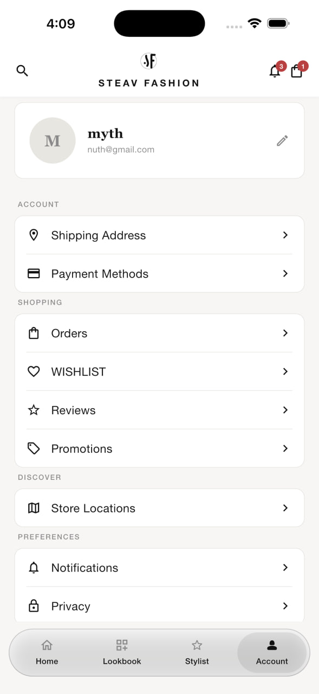 | 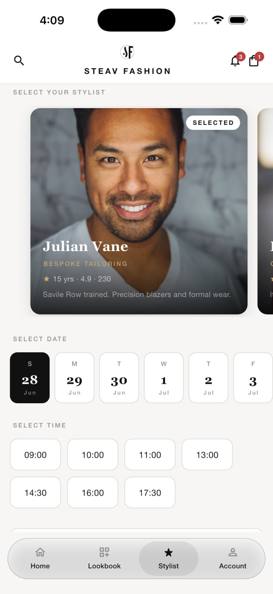 | 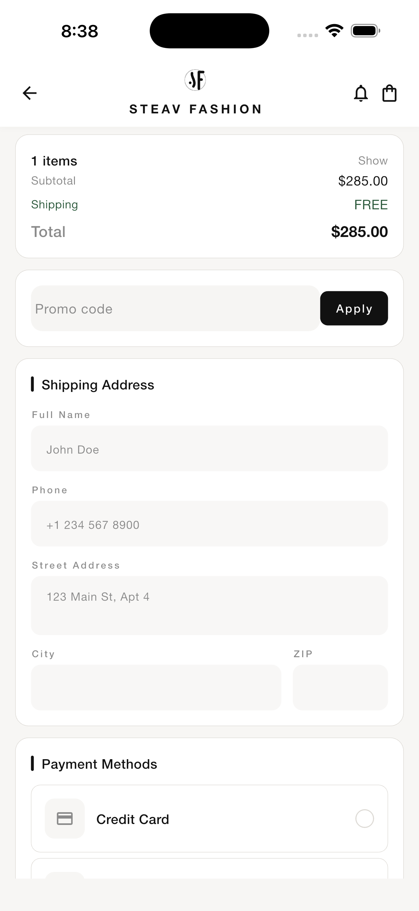 | 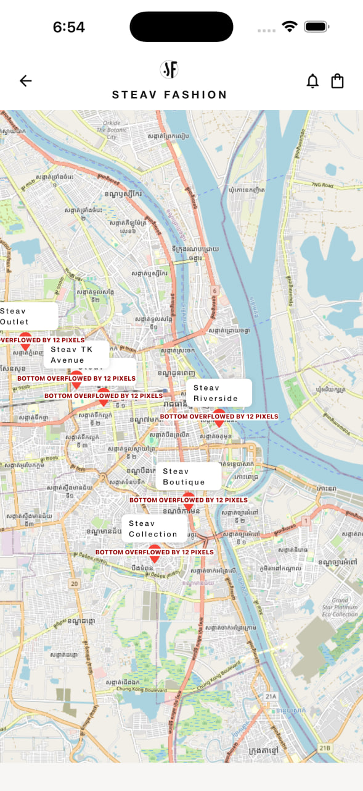 |

| Dark Mode | Notifications | Loading | Khmer Text |
|-----------|---------------|---------|------------|
| 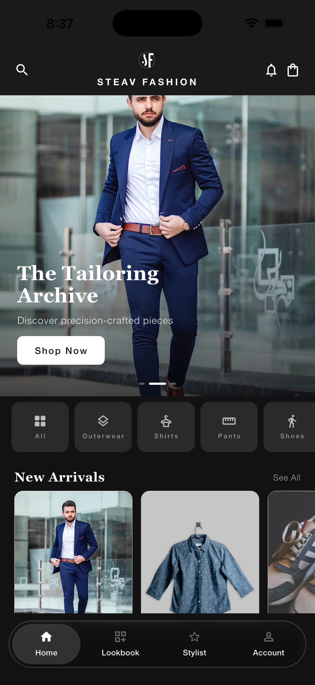 | 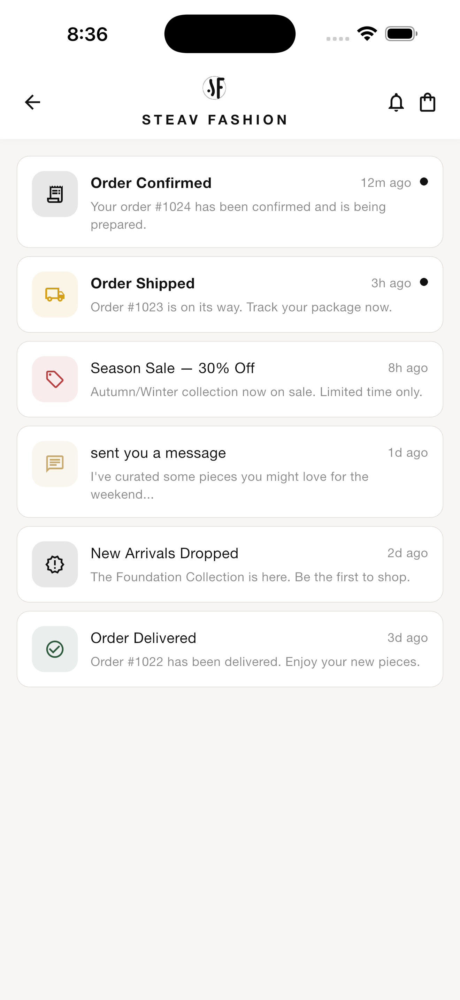 | 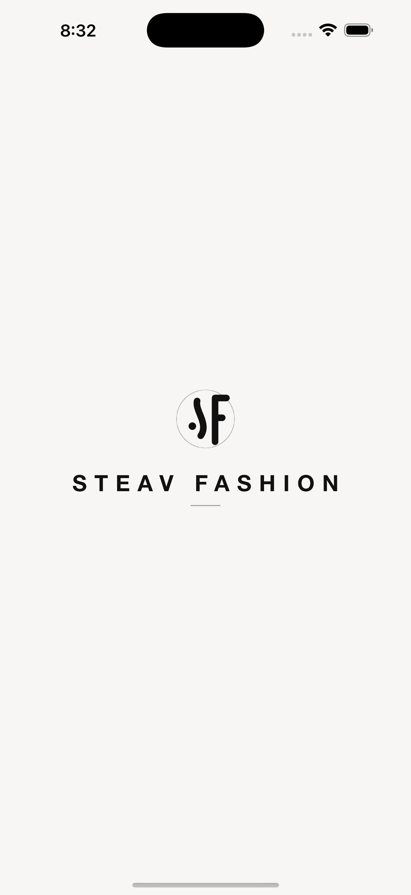 | 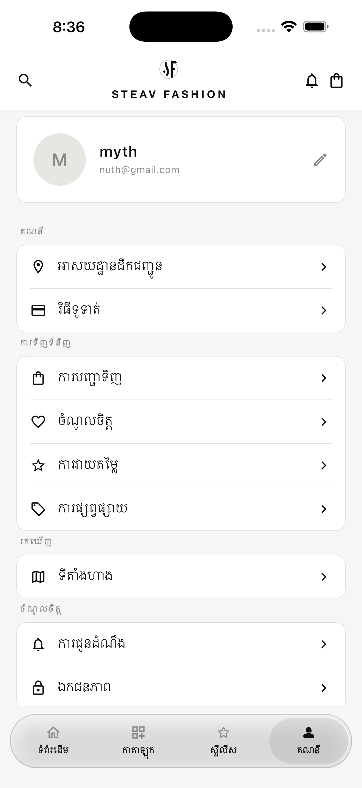 |

---

## Features

### Mobile App (Flutter)

- **Splash & Onboarding** — Animated branded splash, 3-slide onboarding flow
- **Authentication** — Login, register, forgot/reset password, JWT persistence
- **Home Screen** — Hero banner ("Volume 04: The Architecture of Tailoring"), category pills, bestsellers, new arrivals, pull-to-refresh
- **Product Catalog** — Grid/listing with category filtering, search, size guide, and multi-attribute filtering (size, color, fit)
- **Product Detail** — Image viewer, ratings, add to cart/wishlist
- **Shopping Cart** — BLoC-managed, quantity controls, swipe-to-delete, empty state
- **Checkout** — Address entry, payment screen (UI), place order
- **Order Management** — Order history + order detail views
- **Wishlist** — Save/favorite products
- **Lookbook (Style Guide)** — Editorial outfit cards
- **Personal Stylist** — Booking screen + real-time chat with stylist "Elena Vance"
- **Profile** — View & edit profile, manage account
- **Theming** — Light + Dark mode with brass accent palette
- **Localization** — Infrastructure for multi-language support (Khmer included)
- **Bottom Navigation** — 5 tabs: Home, Shop, Lookbook, Stylist, Account

### Backend API (NestJS / GraphQL)

- **Authentication** — JWT-based register/login, protected resolvers, forgot/reset password with UUID tokens
- **User Management** — CRUD, profile updates with bcrypt password hashing
- **Product Catalog** — CRUD, search by name/description, filter by size/color/fit/category/new arrivals
- **Categories** — CRUD with image support
- **Orders** — Create, cancel, return with status tracking + cart items
- **Reviews** — Per-product ratings with title/comment, sorted newest first
- **Editorial Looks** — CRUD lookbook entries (title, subtitle, tag, image, product link)
- **Database Seeding** — 15 products, 6 categories, 9 looks, 1 test user (`test@monograph.com` / `password123`)

---

## Folder Structure

```
Project/
├── backend/
│   ├── _test.ts
│   ├── cloudinary-setup.js
│   ├── docker-compose.yaml
│   ├── Dockerfile
│   ├── eslint.config.mjs
│   ├── image.png
│   ├── nest-cli.json
│   ├── package-lock.json
│   ├── package.json
│   ├── README.md
│   ├── src/
│   │   ├── app.controller.spec.ts
│   │   ├── app.controller.ts
│   │   ├── app.module.ts
│   │   ├── app.service.ts
│   │   ├── auth/
│   │   │   ├── auth.controller.ts
│   │   │   ├── auth.module.ts
│   │   │   ├── auth.resolver.ts
│   │   │   ├── auth.service.ts
│   │   │   ├── decorators/
│   │   │   │   └── current-user.decorator.ts
│   │   │   ├── dto/
│   │   │   │   └── login.input.ts
│   │   │   ├── entities/
│   │   │   │   └── auth-payload.entity.ts
│   │   │   └── guards/
│   │   │       ├── gql-auth.guard.ts
│   │   │       └── jwt-auth.guard.ts
│   │   ├── category/
│   │   │   ├── category.module.ts
│   │   │   ├── category.resolver.ts
│   │   │   ├── category.service.ts
│   │   │   ├── dto/
│   │   │   │   └── create-category.input.ts
│   │   │   └── entities/
│   │   │       └── category.entity.ts
│   │   ├── look/
│   │   │   ├── dto/
│   │   │   │   └── create-look.input.ts
│   │   │   ├── entities/
│   │   │   │   └── look.entity.ts
│   │   │   ├── look.module.ts
│   │   │   ├── look.resolver.ts
│   │   │   └── look.service.ts
│   │   ├── main.ts
│   │   ├── order/
│   │   │   ├── dto/
│   │   │   │   ├── cart-item.input.ts
│   │   │   │   ├── create-order.input.ts
│   │   │   │   └── update-order.input.ts
│   │   │   ├── entities/
│   │   │   │   ├── cart-item.entity.ts
│   │   │   │   └── order.entity.ts
│   │   │   ├── order.module.ts
│   │   │   ├── order.resolver.ts
│   │   │   └── order.service.ts
│   │   ├── product/
│   │   │   ├── dto/
│   │   │   │   ├── create-product.input.ts
│   │   │   │   └── update-product.input.ts
│   │   │   ├── entities/
│   │   │   │   └── product.entity.ts
│   │   │   ├── product.module.ts
│   │   │   ├── product.resolver.spec.ts
│   │   │   ├── product.resolver.ts
│   │   │   ├── product.service.spec.ts
│   │   │   └── product.service.ts
│   │   ├── review/
│   │   │   ├── dto/
│   │   │   │   └── create-review.input.ts
│   │   │   ├── entities/
│   │   │   │   └── review.entity.ts
│   │   │   ├── review.module.ts
│   │   │   ├── review.resolver.ts
│   │   │   └── review.service.ts
│   │   ├── schema.gql
│   │   ├── seed/
│   │   │   └── seed.ts
│   │   └── user/
│   │       ├── dto/
│   │       │   ├── create-user.input.ts
│   │       │   └── update-user.input.ts
│   │       ├── entities/
│   │       │   └── user.entity.ts
│   │       ├── user.module.ts
│   │       ├── user.resolver.ts
│   │       └── user.service.ts
│   ├── test/
│   │   ├── app.e2e-spec.ts
│   │   └── jest-e2e.json
│   ├── tsconfig.build.json
│   └── tsconfig.json
├── Cloth-Men-Shop/
│   ├── analysis_options.yaml
│   ├── assets/
│   │   ├── images/
│   │   │   └── products/
│   │   └── mock/
│   │       ├── coupons.json
│   │       ├── products.json
│   │       ├── reviews.json
│   │       └── stores.json
│   ├── devtools_options.yaml
│   ├── image/
│   │   ├── account.png
│   │   ├── darkmode.png
│   │   ├── filter.png
│   │   ├── Home.png
│   │   ├── listproduct.png
│   │   ├── loading.png
│   │   ├── location.png
│   │   ├── login.png
│   │   ├── lookbook.png
│   │   ├── notification.png
│   │   ├── payment.png
│   │   ├── productdeatail.png
│   │   ├── register.png
│   │   ├── search.png
│   │   ├── stylist.png
│   │   └── textkhmer.png
│   ├── lib/
│   │   ├── main.dart
│   │   ├── core/
│   │   │   ├── constants/
│   │   │   │   ├── api_config.dart
│   │   │   │   ├── app_assets.dart
│   │   │   │   └── app_strings.dart
│   │   │   ├── l10n/
│   │   │   │   ├── app_localizations.dart
│   │   │   │   └── language_bloc.dart
│   │   │   ├── theme/
│   │   │   │   ├── app_colors.dart
│   │   │   │   ├── app_decorations.dart
│   │   │   │   ├── app_theme.dart
│   │   │   │   ├── app_typography.dart
│   │   │   │   └── theme_bloc.dart
│   │   │   └── utils/
│   │   │       ├── haptics.dart
│   │   │       ├── size_helper.dart
│   │   │       └── validators.dart
│   │   ├── data/
│   │   │   ├── datasources/
│   │   │   │   ├── local/
│   │   │   │   │   └── cache_service.dart
│   │   │   │   └── remote/
│   │   │   │       ├── api_service.dart
│   │   │   │       └── graphql_service.dart
│   │   │   ├── models/
│   │   │   │   ├── cart_item_model.dart
│   │   │   │   ├── category_model.dart
│   │   │   │   ├── look_model.dart
│   │   │   │   ├── message_model.dart
│   │   │   │   ├── order_model.dart
│   │   │   │   ├── product_model.dart
│   │   │   │   ├── review_model.dart
│   │   │   │   └── user_model.dart
│   │   │   └── repositories/
│   │   │       ├── auth_repository.dart
│   │   │       ├── chat_repository.dart
│   │   │       ├── look_repository.dart
│   │   │       ├── order_repository.dart
│   │   │       ├── product_repository.dart
│   │   │       └── review_repository.dart
│   │   ├── domain/
│   │   │   └── usecases/
│   │   │       ├── filter_by_size_usecase.dart
│   │   │       ├── get_products_usecase.dart
│   │   │       └── place_order_usecase.dart
│   │   ├── features/
│   │   │   ├── auth/
│   │   │   │   ├── bloc/
│   │   │   │   │   ├── auth_bloc.dart
│   │   │   │   │   ├── auth_event.dart
│   │   │   │   │   └── auth_state.dart
│   │   │   │   └── screens/
│   │   │   │       ├── forgot_password_screen.dart
│   │   │   │       ├── login_screen.dart
│   │   │   │       ├── register_screen.dart
│   │   │   │       └── reset_password_screen.dart
│   │   │   ├── cart/
│   │   │   │   ├── bloc/
│   │   │   │   │   ├── cart_bloc.dart
│   │   │   │   │   ├── cart_event.dart
│   │   │   │   │   └── cart_state.dart
│   │   │   │   ├── screens/
│   │   │   │   │   └── cart_screen.dart
│   │   │   │   └── widgets/
│   │   │   │       └── cart_item_tile.dart
│   │   │   ├── catalog/
│   │   │   │   ├── bloc/
│   │   │   │   │   ├── catalog_bloc.dart
│   │   │   │   │   ├── catalog_event.dart
│   │   │   │   │   └── catalog_state.dart
│   │   │   │   ├── screens/
│   │   │   │   │   ├── catalog_screen.dart
│   │   │   │   │   ├── product_detail_screen.dart
│   │   │   │   │   ├── search_screen.dart
│   │   │   │   │   └── size_guide_screen.dart
│   │   │   │   └── widgets/
│   │   │   │       ├── color_selector.dart
│   │   │   │       ├── filter_bottom_sheet.dart
│   │   │   │       ├── fit_guide_widget.dart
│   │   │   │       ├── product_card.dart
│   │   │   │       └── size_selector.dart
│   │   │   ├── checkout/
│   │   │   │   ├── bloc/
│   │   │   │   │   ├── checkout_bloc.dart
│   │   │   │   │   ├── checkout_event.dart
│   │   │   │   │   └── checkout_state.dart
│   │   │   │   └── screens/
│   │   │   │       ├── address_screen.dart
│   │   │   │       ├── checkout_screen.dart
│   │   │   │       └── payment_screen.dart
│   │   │   ├── home/
│   │   │   │   ├── screens/
│   │   │   │   │   └── home_screen.dart
│   │   │   │   └── widgets/
│   │   │   │       ├── bestsellers_section.dart
│   │   │   │       ├── category_bar.dart
│   │   │   │       ├── hero_section.dart
│   │   │   │       ├── home_constants.dart
│   │   │   │       ├── home_typography.dart
│   │   │   │       ├── new_arrivals_section.dart
│   │   │   │       ├── philosophy_section.dart
│   │   │   │       └── press_banner.dart
│   │   │   ├── map/
│   │   │   │   └── screens/
│   │   │   │       └── map_screen.dart
│   │   │   ├── media/
│   │   │   │   └── screens/
│   │   │   │       └── media_screen.dart
│   │   │   ├── nearby/
│   │   │   │   └── screens/
│   │   │   │       └── nearby_screen.dart
│   │   │   ├── notifications/
│   │   │   │   └── screens/
│   │   │   │       └── notifications_screen.dart
│   │   │   ├── onboarding/
│   │   │   │   └── onboarding_screen.dart
│   │   │   ├── orders/
│   │   │   │   ├── bloc/
│   │   │   │   │   ├── orders_bloc.dart
│   │   │   │   │   ├── orders_event.dart
│   │   │   │   │   └── orders_state.dart
│   │   │   │   └── screens/
│   │   │   │       ├── order_detail_screen.dart
│   │   │   │       └── orders_screen.dart
│   │   │   ├── profile/
│   │   │   │   ├── bloc/
│   │   │   │   │   ├── profile_bloc.dart
│   │   │   │   │   ├── profile_event.dart
│   │   │   │   │   └── profile_state.dart
│   │   │   │   └── screens/
│   │   │   │       ├── edit_profile_screen.dart
│   │   │   │       ├── info_page.dart
│   │   │   │       └── profile_screen.dart
│   │   │   ├── promotions/
│   │   │   │   └── screens/
│   │   │   │       └── promotions_screen.dart
│   │   │   ├── reviews/
│   │   │   │   ├── screens/
│   │   │   │   │   └── reviews_screen.dart
│   │   │   │   └── widgets/
│   │   │   │       └── fit_feedback_bar.dart
│   │   │   ├── splash/
│   │   │   │   └── splash_screen.dart
│   │   │   ├── style_guide/
│   │   │   │   ├── screens/
│   │   │   │   │   └── style_guide_screen.dart
│   │   │   │   └── widgets/
│   │   │   │       └── outfit_card.dart
│   │   │   ├── stylist/
│   │   │   │   ├── bloc/
│   │   │   │   │   ├── chat_bloc.dart
│   │   │   │   │   ├── chat_event.dart
│   │   │   │   │   └── chat_state.dart
│   │   │   │   └── screens/
│   │   │   │       ├── stylist_booking_screen.dart
│   │   │   │       └── stylist_chat_screen.dart
│   │   │   └── wishlist/
│   │   │       ├── bloc/
│   │   │       │   ├── wishlist_bloc.dart
│   │   │       │   ├── wishlist_event.dart
│   │   │       │   └── wishlist_state.dart
│   │   │       └── screens/
│   │   │           └── wishlist_screen.dart
│   │   ├── navigation/
│   │   │   ├── app_router.dart
│   │   │   └── bottom_nav_bar.dart
│   │   └── shared/
│   │       └── widgets/
│   │           ├── animated_list_item.dart
│   │           ├── custom_button.dart
│   │           ├── custom_text_field.dart
│   │           ├── empty_state_widget.dart
│   │           ├── loading_indicator.dart
│   │           ├── monograph_header.dart
│   │           ├── product_image_viewer.dart
│   │           ├── rating_stars.dart
│   │           ├── shimmer_loading.dart
│   │           └── steav_fashion_logo.dart
│   └── pubspec.yaml
└── II/
    └── Mobile/
        └── Project/
            └── backend/
                └── src/
                    └── address/
                        └── dto/
```

---

## Tech Stack

### Frontend (Flutter)
| Category | Technology |
|----------|-----------|
| Framework | Flutter / Dart 3.11 |
| State Management | flutter_bloc 9.x |
| Routing | go_router 14.x |
| HTTP/GraphQL | http 1.x (custom wrapper) |
| Secure Storage | flutter_secure_storage 9.x |
| Image Caching | cached_network_image 3.x |
| Animations | flutter_staggered_animations |
| Swipe Actions | flutter_slidable |
| Platform | Android, iOS, Web, macOS, Linux, Windows |

### Backend (NestJS)
| Category | Technology |
|----------|-----------|
| Framework | NestJS 11.x (TypeScript) |
| API | GraphQL (Apollo Server 5.x) |
| ORM | TypeORM |
| Database | PostgreSQL (Neon serverless) |
| Auth | JWT (passport-jwt) + bcrypt |
| Image Hosting | Cloudinary |
| Validation | class-validator / class-transformer |
| Containerization | Docker (Node 22 Alpine) |

---

## Getting Started

### Backend

```bash
cd backend
npm install

# Set up .env with your DATABASE_URL, JWT_SECRET, and Cloudinary keys
cp .env.example .env

# Run database seed
npm run seed

# Start development server
npm run run start:dev
```

### Mobile App

```bash
cd Cloth-Men-Shop
flutter pub get
flutter run
```

The app connects to the API at the URL configured in `lib/core/constants/api_config.dart`.


## License

MIT
